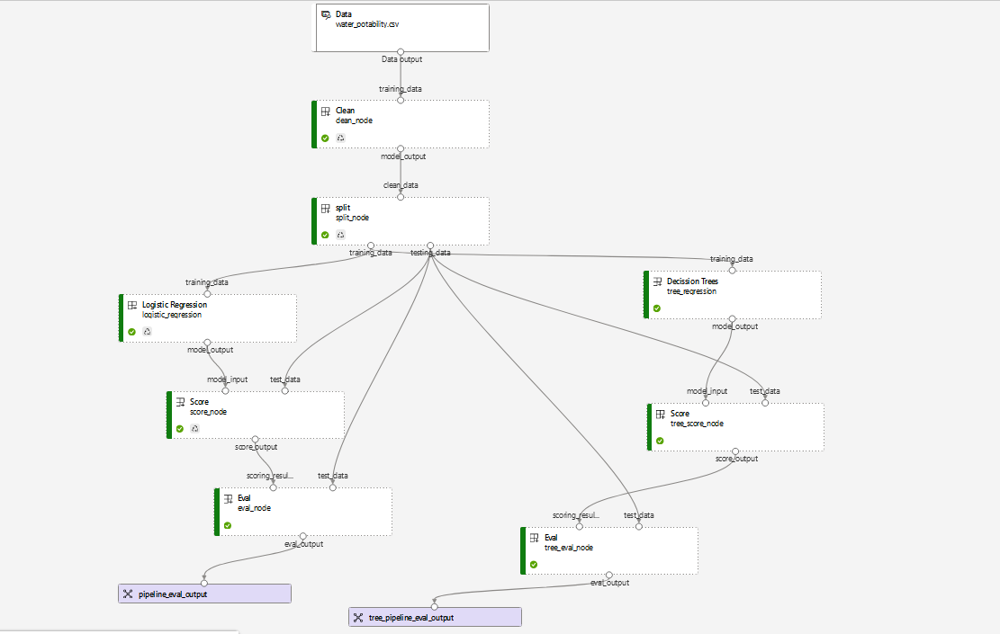

# Diplomado_ML_2023-Proyecto_2-Ronald-Mayra

1. load the project as a folder into notebooks of Azure ML
2. Init variable on notebook orchestrator.ipynb
   2.1 Set subscription id
   2.2 Set resource group name
   2.3 Set  workspace Name
3. Excecute requirements.ipynb
4. Excecute orchestrator.ipynb

Pipeline Model

